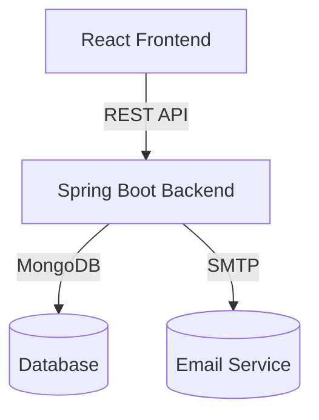

# Event Management System

A full-stack event management platform with a Spring Boot backend and a modern React frontend.

---

## Table of Contents

- [Features](#features)
- [Architecture](#architecture)
- [Backend Setup](#backend-setup)
- [Frontend Setup](#frontend-setup)
- [Configuration](#configuration)
- [API Overview](#api-overview)
- [Testing](#testing)
- [License](#license)

---

## Features

- User registration, login, and JWT-based authentication
- Role-based dashboards (Admin, Organizer, Attendee)
- Event creation, update, and registration
- Email notifications
- MongoDB for data storage
- Responsive, modern UI (React + Tailwind CSS)
- OpenAPI/Swagger documentation

---

## Architecture



---

## Backend Setup

**Tech Stack:** Java 17, Spring Boot 3, MongoDB

1. **Install Java 17** and [Maven](https://maven.apache.org/).
2. **Configure MongoDB:**
   - Default URI: `mongodb://localhost:27017/fontend`
   - Or set `MONGODB_URI` environment variable.
3. **Configure Email (Mailtrap by default):**  
   Edit `backend/src/main/resources/application.yml` for SMTP settings.
4. **Build & Run:**
   ```sh
   cd backend
   mvn clean install
   mvn spring-boot:run
   ```
5. **API Docs:**  
   Visit [http://localhost:8080/swagger-ui.html](http://localhost:8080/swagger-ui.html)

---

## Frontend Setup

**Tech Stack:** React 18, TypeScript, Vite, Tailwind CSS

1. **Install Node.js (v18+) and npm**
2. **Install dependencies:**
   ```sh
   cd frontend
   npm install
   ```
3. **Run the app:**
   ```sh
   npm run dev
   ```
4. **Build for production:**
   ```sh
   npm run build
   ```

---

## Configuration

- **Backend:**  
  Edit `backend/src/main/resources/application.yml` for DB, JWT, mail, and logging.
- **Frontend:**  
  API base URL and other settings can be configured in `frontend/src/services/`.

---

## API Overview

| Endpoint             | Method | Description         |
| -------------------- | ------ | ------------------- |
| `/api/auth/register` | POST   | Register a new user |
| `/api/auth/login`    | POST   | User login          |
| `/api/events`        | CRUD   | Manage events       |
| `/api/registrations` | CRUD   | Register for events |
| `/api/users/profile` | GET    | Get user profile    |
| `/api/dashboard`     | GET    | Dashboard data      |

> See Swagger UI for full API details.

---

## Testing

- **Backend:**
  ```sh
  cd backend
  mvn test
  ```
- **Frontend:**  
  Add your preferred testing framework (e.g., Jest, React Testing Library).

---

## License

This project is licensed under the MIT License.
